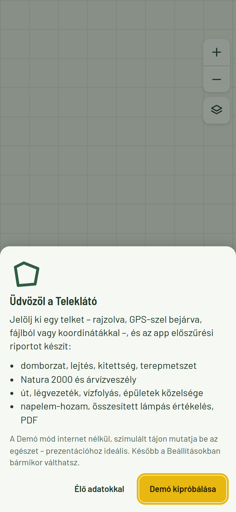
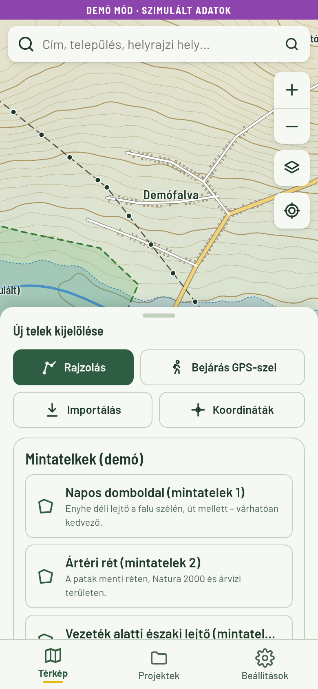
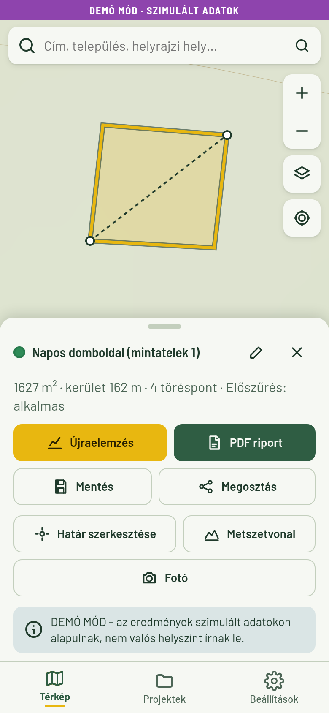
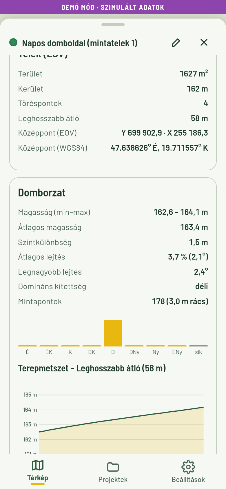
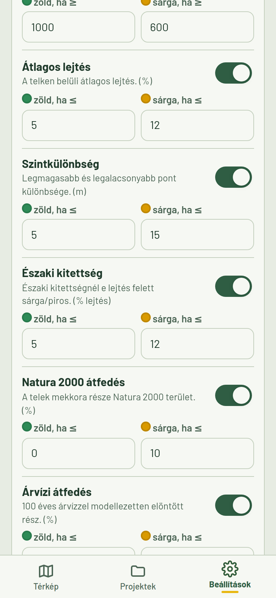
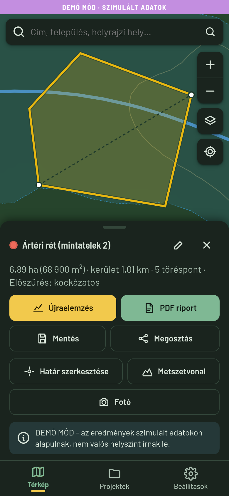

# Teleklátó

Androidra telepíthető térinformatikai **telek-előszűrő** app ingatlanfejlesztőknek, építészirodáknak,
napelemes cégeknek és földmérőknek. A telket térképen rajzolod, GPS-szel bejárod, fájlból importálod
vagy koordinátákkal adod meg; az app elemzi a domborzatot, a lejtést és kitettséget, a Natura 2000 és
árvízi érintettséget, az út / légvezeték / vízfolyás / épületek közelségét és a napelem-hozamot,
majd zöld–sárga–piros lámpákkal értékel, és PDF riportot készít.

> Az eredmény **előszűrés**: nem helyettesíti a tulajdoni lapot, a helyi építési szabályzatot (HÉSZ),
> a szakhatósági állásfoglalást és a geodéziai felmérést.

| Üdvözlés | Demó térkép | Eredmény | Metszet | Szabályok | Sötét téma |
|---|---|---|---|---|---|
|  |  |  |  |  |  |

## Funkciók

- **Telek kijelölése:** rajzolás érintéssel (pont hozzáadása, visszavonás, csúcs húzása, beszúrás,
  lezárás); GPS-bejárás (pontrögzítés gombnyomásra átlagolással vagy automatikusan X méterenként,
  pontosság-kijelzés, gyenge jelnél figyelmeztetés); import GeoJSON / KML / DXF (EOV) fájlból vagy más
  appból megosztva; koordináta-bevitel (WGS84 tizedes vagy fok-perc-másodperc, EOV); címkeresés.
- **Elemzés** (folyamatjelzővel, lépésenkénti hibakezeléssel, a DEM-feldolgozás Web Workerben):
  terület, kerület, középpont EOV-ban; min/max/átlag magasság, átlagos és max. lejtés, domináns
  kitettség, terepmetszet a leghosszabb átló és egy saját vonal mentén; Natura 2000 és árvízi átfedés %;
  legközelebbi út, légvezeték (keresztezés külön jelölve), vízfolyás, épület; PVGIS napelem-hozam.
- **Szabályalapú pontozás:** szempontonkénti lámpák indoklással + összesített ítélet. A küszöbök a
  Beállításokban szerkeszthetők, profilok (Általános, Napelempark, Lakóépület), JSON export/import.
- **Projektek:** mentés SQLite-ba (név, megjegyzés, címkék, geometria, elemzés, fotók), keresés,
  törlés, 2–3 telek összehasonlítása.
- **Terepi fotók:** kamera, GPS-pozíció és iránytű-irány, jelölő a térképen, a riportban is.
- **Riport és megosztás:** PDF (cégnév/logó, térképkép méretléccel, mutatók, lámpák, metszet, EOV
  töréspontok, fotók, adatforrások, jogi nyilatkozat); export GeoJSON (WGS84 / EOV) és KML; natív Share.
- **Offline:** a már elemzett telkek és a gyorsítótárazott adatok internet nélkül is újraelemezhetők;
  hálózat nélkül az app megmondja, mely lépések maradnak ki.
- **Demó mód:** szimulált táj (domborzat, patak, falu, utak, légvezeték, Natura terület, ártér) és
  3 mintatelek, teljesen internet nélkül – prezentációhoz. Mindig jelölve a felületen és a riportban.

## Adatforrások

| Adat | Forrás | Megjegyzés |
|---|---|---|
| Alaptérkép | [OpenFreeMap](https://openfreemap.org) (OpenStreetMap) | kulcs nélkül, kereskedelmi célra is |
| Ortofotó | Lechner Tudásközpont INSPIRE WMS (OI.2022) | opcionális réteg, WMS 1.3.0 |
| Domborzat | Copernicus DEM GLO-30 (AWS Open Data, COG) | ~30 m felbontás |
| Közelség | OpenStreetMap – Overpass API | az OSM teljességétől függ |
| Natura 2000 | EEA (beépített HU kivonat + élő ArcGIS REST) | 525 terület |
| Árvízveszély | JRC – River flood hazard maps for Europe, 100 éves | ~90 m felbontás |
| Napelem | PVGIS 5.3 (JRC) | SARAH3 |
| Címkeresés | Nominatim (OSM) | max. 1 kérés/s |

A forrásokat a CI minden futáskor valódi próbahívással ellenőrzi (`npm run check:sources`, eredmény a
GitHub Actions futás összefoglalójában). Részletek: [PLAN.md](PLAN.md).

## Előfeltételek

| Eszköz | Verzió |
|---|---|
| Node.js | 22 LTS (min. 20.19) |
| JDK | 21 (pl. Temurin 21) |
| Android Studio | 2025.x vagy újabb |
| Android SDK | Platform **36** (Android 16), Build-Tools 35.0.0+, Platform-Tools |
| Gradle / AGP | a wrapper automatikusan letölti (Gradle 8.14.3, AGP 8.13) |
| Minimum Android | 7.0 (API 24) |

Az SDK-t Android Studióban a *Settings → Languages & Frameworks → Android SDK* menüben telepítheted.
Állítsd be az `ANDROID_HOME` környezeti változót (vagy írd az `android/local.properties` fájlba:
`sdk.dir=/útvonal/android-sdk`).

## Fejlesztés

```bash
npm ci
npm run data:natura   # (ajánlott) Natura 2000 HU kivonat letöltése → public/data/ (~5 MB)
npm run dev           # böngészős fejlesztés: http://localhost:5173
npm test              # Vitest (106 teszt)
npm run lint          # ESLint + Prettier
npm run build         # típusellenőrzés + produkciós build → dist/
```

Böngészőben a demó mód teljesen működik. Az élő források egy része (Copernicus DEM, PVGIS, JRC) nem
küld CORS-fejlécet, ezért ezek csak az Android appból (natív HTTP-n) érhetők el – böngészőben
érthető hibaüzenetet kapsz.

## Android: debug APK és emulátor

```bash
npm run android:debug
# = npm run build && npx cap sync android && cd android && ./gradlew assembleDebug
```

Az APK: `android/app/build/outputs/apk/debug/app-debug.apk`

Futtatás emulátoron:

1. Android Studio → *Device Manager* → hozz létre egy eszközt (pl. Pixel 8, API 36).
2. `npx cap run android` (kiválasztja a futó emulátort), vagy `npx cap open android` és Run ▶.
3. GPS-bejárás teszteléséhez: emulátor *Extended controls (…) → Location* – pont vagy GPX útvonal.

**CI-ből:** minden push után a GitHub Actions felépíti a debug APK-t: *Actions → Android build →
a futás → Artifacts → `teleklato-debug-apk`*.

## Aláírt release APK

1. Kulcs létrehozása (egyszer; **őrizd meg biztonságosan** – elvesztése után nem adhatsz ki frissítést):

   ```bash
   keytool -genkeypair -v -keystore teleklato-release.jks -alias teleklato \
     -keyalg RSA -keysize 4096 -validity 10000
   ```

2. Másold a fájlt az `android/` mappába, és hozd létre az `android/keystore.properties` fájlt
   (mindkettő ki van zárva a verziókezelésből):

   ```properties
   storeFile=teleklato-release.jks
   storePassword=********
   keyAlias=teleklato
   keyPassword=********
   ```

3. Build:

   ```bash
   npm run android:release
   # → android/app/build/outputs/apk/release/app-release.apk
   ```

4. Ellenőrzés: `$ANDROID_HOME/build-tools/<verzió>/apksigner verify --print-certs app-release.apk`

Google Play-hez App Bundle kell: `cd android && ./gradlew bundleRelease`.

**CI-ben:** add meg a repó *Settings → Secrets and variables → Actions* alatt:
`ANDROID_KEYSTORE_BASE64` (`base64 -w0 teleklato-release.jks`), `ANDROID_KEYSTORE_PASSWORD`,
`ANDROID_KEY_ALIAS`, `ANDROID_KEY_PASSWORD`. Ezután *Actions → Android build → Run workflow* (vagy egy
`v*` tag) aláírt release APK-t készít, és GitHub Release-ként közzéteszi. Titkok nélkül a CI
buildenként új kulcsot generál: az APK így is kiadási (nem debug) aláírást kap, de a frissítéshez
előbb el kell távolítani az előzőt.

## Telepítés telefonra

**USB-n (adb):**

1. Telefonon: *Beállítások → A telefonról → Build-szám* 7× koppintás → *Fejlesztői beállítások →
   USB-hibakeresés* bekapcsolása.
2. Csatlakoztasd USB-n, engedélyezd a számítógépet a telefonon.
3. `adb install -r app-debug.apk` (frissítéshez is, az adatok megmaradnak).

**Fájlmegosztással:**

1. Küldd át az APK-t (e-mail, Drive, Teams, USB-másolás).
2. Nyisd meg a telefonon; első alkalommal az Android megkérdezi, hogy az adott alkalmazás (pl. Fájlok,
   Chrome) telepíthet-e **ismeretlen forrásból** származó appot → *Engedélyezés*
   (*Beállítások → Alkalmazások → Speciális hozzáférés → Ismeretlen alkalmazások telepítése*).
3. A Play Protect figyelmeztethet („nem ismert fejlesztő”) → *Telepítés mindenképp*.

> Debug és release APK nem frissíti egymást (eltérő aláírás) – előbb távolítsd el a másikat.

## Engedélyek

Csak a szükségesek: internet, helymeghatározás (bejárás, saját pozíció, fotó helye), kamera (terepi
fotó), hálózati állapot. A hely- és kameraengedély előtt az app rövid magyarázó képernyőt mutat.

## Architektúra

Vite + TypeScript (strict), keretrendszer nélküli komponensek, MapLibre GL JS, saját érintőbarát
csúcsszerkesztő, Turf.js + saját síkgeometria (minden méteres számítás EOV-ban, proj4), geotiff.js
(COG range request), jsPDF (beágyazott Barlow betű), Capacitor 8. Részletek: [CLAUDE.md](CLAUDE.md).

```
src/analysis  geometria, EOV, domborzat (Worker), átfedés, közelség, pontozás, összehasonlítás
src/services  élő források egységes DataService-interfésszel, cache, ütemező
src/demo      szimulált táj, mintatelkek, demó szolgáltató
src/map       MapLibre, stílusok, szerkesztő, rétegek
src/ui        képernyők, panel, dialógusok, bejárás, fotók, import
src/report    PDF, GeoJSON/KML export
src/storage   SQLite / IndexedDB repository, gyorsítótár
src/native    Capacitor-csomagolók, Android megosztás-fogadó plugin
```

## Ismert korlátok

- A 30 m-es DEM kis (néhány száz m²-es) telkeknél csak tájékoztató lejtést ad.
- A közelségi adatok az OpenStreetMap teljességétől függnek (földkábel, közmű gyakran hiányzik).
- A JRC árvízmodell ~90 m-es; kis vízfolyások és belvíz nem szerepelnek benne.
- Az ortofotó és az élő Natura-lekérdezés külső szolgáltatás – kiesésnél az app jelzi, nem becsül.

## Hibaelhárítás

| Jelenség | Teendő |
|---|---|
| „A háttértérkép nem tölthető be” | Nincs internet – kapcsold be a Demó módot, vagy próbáld újra hálózattal. |
| „Nem érkezett GPS-jel” | Menj szabad ég alá, kapcsold be a pontos helymeghatározást. |
| Lépés „kimaradt” az elemzésben | Offline voltál; csatlakozz és nyomd meg az Újraelemzés gombot. |
| `SDK location not found` | Állítsd be az `ANDROID_HOME`-ot vagy az `android/local.properties`-t. |
| Gradle: nem érhető el a `dl.google.com` | Korlátozott hálózat: a GitHub Actions build használható (lásd fent). |

## Licencek

A forráskód a projekt tulajdonosáé. Betűtípus: Barlow (SIL Open Font License 1.1). Az adatforrások
licencei és attribúciói az appban (*Beállítások → Adatforrások és licencek*) és minden riportban
megjelennek.
